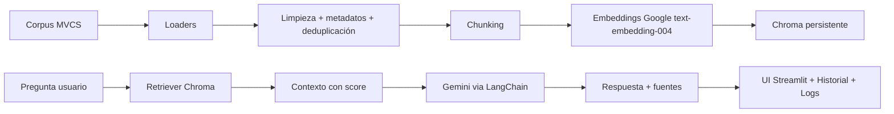

# Asistente MVCS (RAG con LangChain + Gemini + Chroma + Streamlit)

## 1) Resumen ejecutivo
Objetivo: construir un MVP que responda preguntas sobre trámites/servicios MVCS con evidencia documental.
Alcance MVP: ingesta (PDF/HTML/TXT/CSV), chunking configurable, indexación Chroma persistente, consulta RAG en español con fuentes, historial por sesión y logging.
Supuestos: corpus oficial provisto por el equipo; API key de Google disponible; ejecución inicial en Colab y despliegue local con Streamlit.

## 2) Arquitectura (flujo end-to-end)


## 3) Implementación paso a paso (repo -> Colab -> app)
1. Crear repo en GitHub.
2. En Colab: clonar repo y crear rama feature.
3. Configurar `.env` con `GOOGLE_API_KEY`.
4. Instalar dependencias (`pip install -r requirements.txt`).
5. Subir documentos a `data/raw/`.
6. Ejecutar indexación: `PYTHONPATH=src python scripts/index_corpus.py`.
7. Levantar app: `PYTHONPATH=src streamlit run app.py`.
8. Probar preguntas y validar fuentes.

## 4) Árbol del proyecto
```text
Asistente_MVCS/
├── app.py
├── requirements.txt
├── .env.example
├── .streamlit/config.toml
├── scripts/index_corpus.py
├── src/mvcs_assistant/
│   ├── config/settings.py
│   ├── ingestion/{loaders.py,preprocess.py}
│   ├── rag/{vectorstore.py,pipeline.py}
│   ├── prompts/templates.py
│   └── utils/logger.py
├── tests/test_preprocess.py
├── data/{raw,processed,chroma}/
└── logs/
```

## 5) Explicación funcional
- `app.py`: interfaz Streamlit, pregunta, respuesta, fuentes, historial.
- `scripts/index_corpus.py`: carga corpus, limpia, deduplica, chunking e indexa.
- `settings.py`: configuración central y variables de entorno.
- `pipeline.py`: retrieval + prompt guardrails + generación Gemini.
- `vectorstore.py`: embeddings Google + Chroma persistente.
- `test_preprocess.py`: pruebas mínimas de limpieza/deduplicación.

## 6) Código por archivo
Todo el código está en este repositorio (copiar/pegar archivo por archivo según estructura).
Procedimiento: crear estructura, pegar contenido, guardar, correr pruebas e indexación.

## 7) Funciones/clases clave
- `Settings`: centraliza configuración.
- `load_documents`: ingesta multipformato.
- `enrich_metadata`: agrega hash, fuente y entidad.
- `deduplicate_docs`: elimina duplicados por hash.
- `ask_rag`: recupera evidencia y consulta Gemini con guardrails.

## 8) Estrategia de pruebas
- Unitarias: limpieza y deduplicación (`pytest`).
- Funcional: indexar corpus y consultar preguntas reales; validar mensaje de no evidencia y fuentes.

## 9) Flujo Colab + GitHub
```bash
# Autenticación recomendada: token en variable temporal de sesión
!git config --global user.name "Tu Nombre"
!git config --global user.email "tu@email.com"

# Clonar
!git clone https://github.com/ORG/Asistente_MVCS.git
%cd Asistente_MVCS

# Rama feature
!git checkout -b feature/rag-mvcs-mvp

# Guardar cambios
!git add .
!git commit -m "feat: MVP RAG MVCS con Streamlit, LangChain, Gemini y Chroma"
!git push -u origin feature/rag-mvcs-mvp
```
PR manual: GitHub mostrará botón “Compare & pull request”.
Buenas prácticas: nunca subir `.env`, usar secretos de Colab y rotar token.

## 10) Checklist calidad y seguridad
- [ ] Sin API keys hardcodeadas.
- [ ] `.env.example` actualizado.
- [ ] Respuestas con fuentes y score.
- [ ] Guardrail de “No tengo evidencia suficiente...”.
- [ ] Logs de errores/consultas.
- [ ] Tests básicos en verde.

## 11) Roadmap MVP -> Producción
1. Reindexación incremental con catálogo de hashes persistidos.
2. Evaluación automática de respuestas (RAGAS o similar).
3. Filtros por tipo de trámite, región y fecha normativa.
4. Observabilidad (trazas, métricas de latencia/costo).
5. Despliegue gestionado (Cloud Run/VM) con CI/CD.
