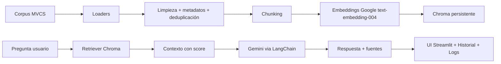

# ChatBotMVCS (RAG con LangChain + Gemini + Chroma + Streamlit)

Proyecto actualizado para publicarse en el repositorio: **`cesarpaico1511/ChatBotMVCS`**.

## 1) Resumen ejecutivo
Objetivo: construir un MVP que responda preguntas sobre trámites/servicios MVCS con evidencia documental oficial.
Alcance MVP: ingesta (PDF/HTML/TXT/CSV), chunking configurable, indexación Chroma persistente, consulta RAG en español con fuentes, historial por sesión y logging.
Supuestos: corpus oficial MVCS disponible, API key de Google activa, desarrollo en Colab y ejecución en Streamlit.

## 2) Arquitectura (flujo end-to-end)


## 3) Implementación paso a paso (repo -> Colab -> app)
1. Crear el repo `cesarpaico1511/ChatBotMVCS` en GitHub.
2. En Colab: clonar repo y crear rama feature.
3. Configurar `.env` con `GOOGLE_API_KEY`.
4. Instalar dependencias (`pip install -r requirements.txt`).
5. Subir documentos a `data/raw/`.
6. Ejecutar indexación: `PYTHONPATH=src python scripts/index_corpus.py`.
7. Levantar app: `PYTHONPATH=src streamlit run app.py`.
8. Probar preguntas y validar fuentes mostradas.

## 4) Árbol del proyecto
```text
ChatBotMVCS/
├── app.py
├── requirements.txt
├── requisitos.txt
├── .env.example
├── .streamlit/config.toml
├── scripts/index_corpus.py
├── src/mvcs_assistant/
│   ├── config/settings.py
│   ├── ingestion/{loaders.py,preprocess.py}
│   ├── rag/{vectorstore.py,pipeline.py}
│   ├── prompts/templates.py
│   └── utils/logger.py
├── tests/test_preprocess.py
├── data/{raw,processed,chroma}/
└── logs/
```

## 5) Explicación funcional
- `app.py`: interfaz Streamlit, pregunta, respuesta, fuentes y score, historial por sesión.
- `scripts/index_corpus.py`: ejecuta carga, limpieza, deduplicación, chunking e indexación.
- `settings.py`: configuración central desde variables de entorno.
- `pipeline.py`: retrieval con Chroma + guardrails + generación con Gemini.
- `vectorstore.py`: embeddings de Google y persistencia en Chroma.
- `test_preprocess.py`: pruebas mínimas para limpieza y deduplicación.

## 6) Código por archivo
Todo el código ya está incluido en este repositorio, listo para copiar/pegar o clonar.

## 7) Funciones/clases clave
- `Settings`: parámetros de entorno y configuración RAG.
- `load_documents`: carga PDF/HTML/TXT/CSV.
- `enrich_metadata`: agrega hash, entidad, fuente.
- `deduplicate_docs`: evita indexar contenido repetido.
- `ask_rag`: consulta, recupera contexto y responde con fuentes.

## 8) Estrategia de pruebas
- Unitarias: `pytest` sobre limpieza y deduplicación.
- Funcionales: indexar corpus real MVCS, consultar y validar fuentes/score/guardrails.

## 9) Flujo Colab + GitHub (repo nuevo)
```bash
# 1) Configurar Git en Colab
!git config --global user.name "Tu Nombre"
!git config --global user.email "tu@email.com"

# 2) Clonar nuevo repo
!git clone https://github.com/cesarpaico1511/ChatBotMVCS.git
%cd ChatBotMVCS

# 3) Crear rama feature
!git checkout -b feature/rag-mvcs-mvp

# 4) Instalar dependencias
!pip install -r requirements.txt

# 5) Guardar cambios y publicar
!git add .
!git commit -m "feat: MVP RAG MVCS con Streamlit, LangChain, Gemini y Chroma"
!git push -u origin feature/rag-mvcs-mvp
```
PR manual: abrir GitHub y usar botón **Compare & pull request**.
Buenas prácticas: no subir `.env`, usar secretos de Colab, no pegar tokens en notebooks.

## 10) Checklist final de calidad y seguridad
- [ ] Sin API keys hardcodeadas.
- [ ] `.env.example` completo y actualizado.
- [ ] Respuestas con fuentes + score.
- [ ] Guardrail: “No tengo evidencia suficiente en las fuentes cargadas”.
- [ ] Logs de consultas/errores en `logs/`.
- [ ] Tests mínimos en verde.

## 11) Roadmap MVP -> Producción
1. Reindexación incremental con catálogo persistente de hashes.
2. Evaluación automática de calidad de respuesta (RAGAS-like).
3. Filtros por trámite, región, tipo de documento y fecha.
4. Observabilidad (métricas de latencia/costo, tracing).
5. CI/CD + despliegue administrado (Cloud Run/VM).
